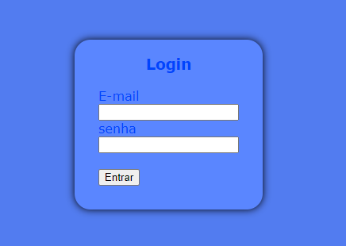

# projeto-login
 
Projeto variado como parte avaliativa de discipina de Fundamentos de Denvolvimentos ministrada pelo professor Leonardo Rocha
 
## índice
* [Descrição](#descrição)
* [Tecnologias](#tecnologias)
* [Referência](#rêferências)
* [Autor(a)](#autora)
 
## Descrição
 
Nesse projeto foi criado uma página de login para se cadastrar em aplicativos.
 
## Resultado do projeto
 

 
## propriedades ultilizadas
 
* body - representa o conteúdo de um documento HTML.
 
* form - representa uma seção de documento que contém controles interativos para enviar informações.
 
* container - estabelece o elemento como um contêiner de consulta e especifica o nome e o tipo do contexto de contenção usado em uma consulta de contêiner.
 
* padding - define a área de preenchimento em todos os quatro lados de um elemento de uma só vez.
* heigth - determina a altura da área do conteúdo de um elemento.
 
* background-color - ultilizado para colocar cor no projeto.
 
* display -  define se um elemento é tratado como um bloco ou elemento inline.
 
* font-family - ultilizado para escolher a fonte das letras.
 
* justify-content - define como o navegador distribui o espaço entre e ao redor dos itens de conteúdo ao longo do eixo principal de um contêiner flexível.
 
* align-items -  estabelece o valor align-self em todos filhos diretos como um grupo.
 
* width -  determina a largura da área de conteúdo de um elemento. A área de conteúdo fica dentro do preenchimento, da borda, e da margem de um elemento.
 
* padding-top - define a altura da área de preenchimento na parte superior de um elemento.
 
* border-radius - deixa as bordas do container arredondadas.
 
* box-shadow -  adiciona efeitos de sombra ao redor do quadro de um elemento.
 
* text-align - ultilizado para centralizar o texto.
 
* display-flex -  define como um item flexível aumentará ou diminuirá para caber no espaço disponível em seu contêiner flexível.
 
 
## Estilização
 
* O projeto foi estilizado ultilizando o arquivo login.css.

```
body{
    background-color: rgb(82, 124, 240);
    display: flex;
    font-family: Verdana, Geneva, Tahoma, sans-serif;
}
```

## Tecnologias
 
* HTML5
* CSS3
* GIT
* Github
* README
 
## Referências
[Mozilla](https://developer.mozilla.org/en-US/docs/Web/CSS/justify-content)
 
## Autor(a)
O projeto foi desenvolvido por:
 
* Rafaela Araujo